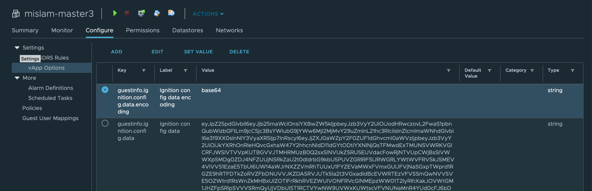

# Creating OpenShift 4.2 Cluster in VMWare <!-- omit in toc -->

## Table of Contents <!-- omit in toc -->

- [Introduction](#introduction)
- [Reference Material and Links](#reference-material-and-links)
- [Recommendations](#recommendations)
- [Common mistakes](#common-mistakes)
- [Cluster Configuration](#cluster-configuration)
- [Setting up Install Node](#setting-up-install-node)
- [Setting up Load Balancer](#setting-up-load-balancer)
- [Spinning up the cluster](#spinning-up-the-cluster)
- [Check controller status](#check-controller-status)
- [Configure Ceph Storage for the image-registry Operator](#configure-ceph-storage-for-the-image-registry-operator)
- [Scaling up Nodes - in progress](#scaling-up-nodes---in-progress)
- [Scaling out Cluster (Adding worker nodes) - in progress](#scaling-out-cluster-adding-worker-nodes---in-progress)
- [Appendix](#appendix)
  - [[A] Command History](#a-command-history)
    - [Install node](#install-node)
    - [Load Balancer](#load-balancer)
  - [[B] install-config.yaml for vmware cluster](#b-install-configyaml-for-vmware-cluster)
  - [[C] append-bootstrap.ign for vmware cluster](#c-append-bootstrapign-for-vmware-cluster)
  - [[D] haproxy.conf for vmware cluster](#d-haproxyconf-for-vmware-cluster)
- [FAQ](#faq)

## Introduction

This document shows step by step guide for installing [OpenShift 4.2](https://docs.openshift.com/container-platform/4.2/welcome/index.html) on csplab environment should not be used as a generic guide. It does not explain the material, rather just a step by step guide as I follow the sources cited below.

## Reference Material and Links

- <https://github.com/ibm-cloud-architecture/refarch-privatecloud/blob/master/Install_OCP_4.x.md>
- <https://docs.openshift.com/container-platform/4.2/installing/installing_vsphere/installing-vsphere.html>
- OCP Client mirror: <https://mirror.openshift.com/pub/openshift-v4/clients/ocp/>

## Recommendations

Below are some recommendations that should be followed.

- Create all the VMs in vSphere and note the mac addresses.
- The VM "Network Adapter" should be assigned to ocp
- Thin Provision hard disks except the install node.
- Have IP addresses assigned to each of the vm (DNS & DHCP already configured)
- Only turn on the install node and load balancer until all the configs are done, check if proper IP address is assigned. If not
  - Is the mac address correct?
  - Is the Network adapter set to OCP (Common mistake)
  - Was there anything wrong with configuring DNS and DHCP server (Talk with [Alec](https://ibm-cloud.slack.com/team/WCBLF8SRZ) or [Victor](https://ibm-cloud.slack.com/team/W3H1D4WAV))
- Ability to SSH into the install node as admin. Although it is possible to use the Web Console in vSphere, I **strongly** recommend using ssh unless someone wants to type a lot as Web Console doesn't support copy-paste

## Common mistakes

- The resource pool, folder name in vSphere and route base (xx.$USER.ocp.csplab.local), the user folder inside /opt MUST match
- Anywhere you see a [square brackets], replace the contents along with the brackets and paste in your content
- Do not turn on the master, worker, storage nodes untill all the configs will done in the install node and load balancer.

## Cluster Configuration

**Node Type**|**Number of Nodes**|**CPU**|**RAM**|**DISK**|**DISK2**
:-----:|:-----:|:-----:|:-----:|:-----:|:-----:
Master|3|16|64|300|
Worker|8|4|16|200|
Storage|3|4|16|200|500
Bootstrap|1|4|16|100|
Install|1|4|16|200|
LB|1|4|16|120|
NFS|1|2|8|500|

**Note:** For installing could pak the workers might need to be scaled up. Common Configs:

**CPAK**|**Number of Worker**|**CPU**|**RAM**|**DISK**|**DISK2**
:-----:|:-----:|:-----:|:-----:|:-----:|:-----:
CP4I|8|16|64|200|
CP4A|8| | | |
CP4Auto|8| | | |
CP4MCM|8| | | |
CP4D|8| | | |

## Setting up Install Node

Use `ocp42-installer-template` as template. It should exist in `CSPLAB->SANDBOX->FastStart2020Templates` but the location might change in the future.

1. ssh into the Install Node. You need root access to complete most of the steps so ensure that's possible.
**NOTE: Replace anything in [square brackets] with your values and remove the brackets**

    ```bash
    ssh sysadmin@[IP address of installer]
    ```

2. Create a directory for your new cluster.  In this document I will use a cluster named after my userid `mislam`. The cluster name **has** to match your sub domain name and resource group name. Otherwise the cluster won't be create.

    ```bash
    mkdir /opt/mislam
    ```

3. Check if `apache2` is installed and running and if not install it.

    ```bash
    sudo apt install apache2
    systemctl status apache2
    ```

4. This will create a document root of `/var/www/html`.  Create a softlink from the document root to your project directory.

    ```bash
    ln -s /opt/mislam /var/www/html/
    ```

5. Download the OpenShift client and installer.

    ```bash
    cd /opt
    wget -c https://mirror.openshift.com/pub/openshift-v4/clients/ocp/4.2.16/openshift-client-linux-4.2.16.tar.gz
    wget -c https://mirror.openshift.com/pub/openshift-v4/clients/ocp/4.2.16/openshift-install-linux-4.2.16.tar.gz
    ```

6. Explode the files into `/opt`

    ```bash
    gunzip -c openshift-client-linux-4.2.16.tar.gz |tar -xvf -
    gunzip -c openshift-install-linux-4.2.16.tar.gz |tar -xvf -
    ```

7. Now copy the `oc` and `kubectl` binaries into your path

    ```bash
    sudo cp oc /usr/local/bin/
    sudo cp kubectl /usr/local/bin/
    ```

8. Create an ssh key for your primary user. Accept the default location for the file.

   ```bash
   ssh-keygen -t rsa -b 4096 -N ''
   ```

9.  Start the ssh agent

    ```bash
    eval "$(ssh-agent -s )"
    ```

10. Add your private key to the ssh-agent

    ```bash
    ssh-add ~/.ssh/id_rsa
    ```

11. You will need a pull secret so your cluster can download the needed containers. Get your pull secret from <https://cloud.redhat.com/openshift/install/vsphere/user-provisioned> and put it into a file in your `/opt` directory (e.g. pull-secret.txt). You will need this in the next step. Go to the link, login with your ibm account, scroll down to pull secret, copy that to clipboard and save it in `/opt/pull-secret.txt`

    ```bash
    vim pull-secret.txt #press `i` to goto insert mode, `cmd+v` to paste, `esc` to exit insert mode and `:wq` to save and quit
    ```

12. In your project directory (`/opt/mislam`), create a file named `install-config.yaml` and paste the following configs.
**NOTE: Replace anything in [square brackets] with your values and remove the brackets**
  
    <details> 
    <summary> Show install-config.yaml </summary>

      ```bash
      apiVersion: v1
      baseDomain: ocp.csplab.local
      compute:
      - hyperthreading: Enabled
      name: worker
      replicas: 0
      controlPlane:
      hyperthreading: Enabled
      name: master
      replicas: 3
      metadata:
      name: [name of your cluster] # in my case mislam as I create /mislam inside of /opt
      platform:
      vsphere:
          vcenter: demo-vcenter.csplab.local
          username: [Muhammad.Islam] # my vSphere username i.e. the login used for vSphere
          password: [********] # your password
          datacenter: CSPLAB
          defaultDatastore: SANDBOX_TIER4
      pullSecret: '[your pull secret. Dont forget the single quotes]'
      sshKey: '[your public ssh-key from ~/.ssh/id_rsa.pub. Dont forget the single quotes]'
      ```

    </details>

    To get your public ssh key do the following, then copy-paste:

    ```bash
    cat ~/.ssh/id_rsa.pub
    ```

    **NOTE:** It is recommended to make a backup of the `install-config.yaml` file as it will be deleted during manifests creation. I create the backup in the /opt directory rather than the project directory but feel free to have it somewhere else.

    ```bash
        cp install-config.yaml /opt/install-config.yaml.bak
    ```

1.  Now it's time to create your manifest files. Go back to `/opt` dir and run the following command. This will create the manifest files inside your project directory (`/mislam` for me). Make sure to **backup** your `install-config.yaml` before creating your manifests if you want to save the config.

    ```bash
    cd /opt
    ./openshift-install create manifests --dir=./mislam  # replace --dir=[contents] with your project dir
    ```

2.  You will need to edit manifests/cluster-scheduler-02-config.yml file and change the value of spec.mastersSchedulable to false.

    ```bash
    vim mislam/manifests//cluster-scheduler-02-config.yml
    ```

    This will make sure the cluster doesn't try to put your applications on master nodes. Red Hat assumes that at some point in the future kubernetes will allow this and you may want to leave it true so you can use your control plane nodes as compute nodes as well.

3.  Now we will create the ignition files. Run the following command from `/opt`. This will **consume** all your manifests file so you might want to create backups.

    ```bash
    ./openshift-install create ignition-configs --dir=./mislam # replace --dir=[contents] with your project dir
    ```

    This will create `bootstrap.ign`, `master.ign`, `worker.ign`, `/auth` and `metadata.json` inside your project directory.

4.  In your project folder (`/opt/mislam`), create a new file named `append-bootstrap.ign` and paste the following contents.
**NOTE: Replace anything in [square brackets] with your values and remove the brackets**

    <details>
    <summary> Show append-bootstrap.ign </summary>

      ```bash
      {
      "ignition": {
          "config": {
          "append": [
              {
              "source": "[http://172.18.6.67/mislam/bootstrap.ign]",
              "verification": {}
              }
          ]
          },
          "timeouts": {},
          "version": "2.1.0"
      },
      "networkd": {},
      "passwd": {},
      "storage": {},
      "systemd": {}
      }
      ```

    </details>

16. In your project directory (`/opt/mislam`), encode `master.ign`, `worker.ign`, and `append-bootstrap.ign` into base64 strings.

    ```bash
    cd /opt/mislam
    base64 -w0 append-bootstrap.ign > append-bootstrap.base64
    base64 -w0 master.ign > master.base64
    base64 -w0 worker.ign > worker.base64
    ```

17. Now login to vSphere, go to your cluster, select your bootstrap node. Then Configure -> Settings -> vApp Options -> Properties. </br>
     </br>

18. You will have two properties one labeled `Ignition config data encoding` and one labeled `Ignition config data`. Select the property labeled `Ignition config data encoding` and click `Set Value` at the top of the table. In the blank, put base64 and click OK.
    On your installation machine cat the text of append-bootstrap.b64 file to the screen:
  
    ```bash
    cat append-bootstrap.base64
    ```

19. Copy the output from this file. Back in the vSphere web client, select the property labeled `Ignition config data` and click `Set Value` at the top of the table. Paste the base64 string in your clipboard into this blank and click OK.
20. Repeat these steps for each node in your cluster. For the `master/control nodes` use the `master.base64` ignition file and for the `compute/worker nodes` use the `worker.base64` text.

Now you have set up your install node. But before moving on some packages should be installed for future steps.

```bash
sudo apt update
sudo apt install jq nmap
```

## Setting up Load Balancer

Use `ocp42-lb-template` as template. Same location as the installer template. We will only configure 1 load balancer but in production environment it is strongly recommended to have 2. Also ensure you have gotten assigned ip addresses for each of your nodes before progressing as they will be necessary.

1. In vSphere, turn on the load balancer. Then from the install node, ssh into the load balancer.
**NOTE: Replace anything in [square brackets] with your values and remove the brackets**

   ```bash
   ssh sysadmin@[ip address of load balancer]
   ```

2. Install `haproxy` package

   ```bash
   sudo apt install haproxy
   ```

3. Now copy and paste the following settings for haproxy.cfg and insert the correct values for any `<brackets>`. Although I recommend inserting the values first and then copying. Also it's a good idea to backup the default haproxy.cfg

   ```bash
   sudo cp haproxy.cfg haproxy.cfg.bak
   sudo vim /etc/haproxy/haproxy.cfg
   ```

    <details>
    <summary>Show haproxy.conf</summary>

      ```bash
      global
          log /dev/log    local0
          log /dev/log    local1 notice
          chroot /var/lib/haproxy
          stats socket /run/haproxy/admin.sock mode 660 level admin
          stats timeout 30s
          user haproxy
          group haproxy
          daemon
          # Default SSL material locations
          ca-base /etc/ssl/certs
          crt-base /etc/ssl/private
          # Default ciphers to use on SSL-enabled listening sockets.
          # For more information, see ciphers(1SSL). This list is from:
          #  https://hynek.me/articles/hardening-your-web-servers-ssl-ciphers/
      #   ssl-default-bind-ciphers ECDH+AESGCM:DH+AESGCM:ECDH+AES256:DH+AES256:ECDH+AES128:DH+AES:ECDH+3DES:DH+3DES:RSA+AESGCM:RSA+AES:RSA+3DES:!aNULL:!MD5:!DSS
      #   ssl-default-bind-options no-sslv3
          ssl-default-bind-ciphers PROFILE=SYSTEM
          ssl-default-server-ciphers PROFILE=SYSTEM
      defaults
          log global
          mode    http
          option  httplog
          option  dontlognull
          retries 3
              timeout http-request  10s
              timeout queue  1m
              timeout connect 10s
              timeout client  1m
              timeout server  1m
              timeout http-keep-alive  10s
              timeout check  10s
          maxconn 3000
      frontend api
          bind *:6443
          mode tcp
          default_backend     api
      frontend machine-config
          bind *:22623
          mode tcp
          default_backend     machine-config
      frontend http
          bind *:80
          mode http
          default_backend     http
      frontend https
          bind *:443
          mode tcp
          default_backend https
      backend api
          mode tcp
          balance roundrobin
          server bootstrap       <IP Address>:6443 check
          server control-plane-0 <IP Address>:6443 check
          server control-plane-1 <IP Address>:6443 check
          server control-plane-2 <IP Address>:6443 check
      backend machine-config
          mode tcp
          balance roundrobin
          server bootstrap       <IP address>:22623 check
          server control-plane-0 <IP address>:22623 check
          server control-plane-1 <IP address>:22623 check
          server control-plane-2 <IP address>:22623 check
      backend http
          balance roundrobin
          mode    http
          server  compute-0 <IP address>:80 check
          server  compute-1 <IP address>:80 check
          server  compute-2 <IP address>:80 check
          server  compute-3 <IP address>:80 check
          server  compute-4 <IP address>:80 check
          server  compute-5 <IP address>:80 check
          server  compute-6 <IP address>:80 check
          server  compute-7 <IP address>:80 check
          server  storage-0 <IP address>:80 check
          server  storage-1 <IP address>:80 check
          server  storage-2 <IP address>:80 check
      backend https
          balance roundrobin
          mode tcp
          server  compute-0 <IP Address>:443 check
          server  compute-1 <IP Address>:443 check
          server  compute-2 <IP Address>:443 check
          server  compute-3 <IP Address>:443 check
          server  compute-4 <IP Address>:443 check
          server  compute-5 <IP Address>:443 check
          server  compute-6 <IP Address>:443 check
          server  compute-7 <IP Address>:443 check
          server  storage-0 <IP Address>:443 check
          server  storage-1 <IP Address>:443 check
          server  storage-2 <IP Address>:443 check
      ```
  
    </details>

4. Now start `haproxy`. Also should do `systemctl enable haproxy` so that it starts up everytime the load balancer restarts.

    ```bash
    sudo systemctl start haproxy  #if already running, try systemctl restart. To check status, do systemctl status
    sudo systemctl enable haproxy
    ```

That's it. Load Balancer in configured.

## Spinning up the cluster

Once the Installer Node and the Load balancer node is configured, it's time to turn on the nodes. Although theoretically all the nodes can be turned on at once, it's recommended not to do so. Here's what I found to be the best steps in case of a failed build.

1. Turn on the Bootstrap node and wait for the IP address to resolve (meaning the vm will have an assigned ip).
2. SSH into the installer node and run the following command

   ```bash
    ./openshift-install --dir=./mislam wait-for bootstrap-complete --log-level info
   ```

    You should see something like this

    ```bash
    INFO Waiting up to 30m0s for the Kubernetes API at https://api.mislam.ocp.csplab.local:6443...
    ```

3. Now we can ssh into the bootstrap node (preferably on a different terminal window) from the installer node. As the `load balancer` is already configured, we can use the routes to ssh instead of IP addresses. Use whichever is easier. And the default user is `core`, not `sysadmin`

   ```bash
   ssh core@[bootstrap.mislam.ocp.csplab.local] # from the install node
   ```

    **Note: You can't ssh into the cluster nodes (bootstrap, compute, control-pane etc) directly from your terminal. You have too ssh into the installer node, and from there you can ssh into anyone of the nodes**

4. We will look at the systemd logs in the bootstrap node. We'll monitor the progress of the installation from here.

   ```bash
   journalctl -b -f -u bootkube.service
   ```

5. Now turn on all the master/control-pane nodes and wait for their IP to resolve. Once their IP resolve, they will boot up and start connection with the bootstrap node and start pulling necessary files. The `journalctl` logs will be updated.

6. If we look at the logs in the `install node` (step 1), we should see this within 30 minutes.

   ```bash
   INFO Waiting up to 30m0s for the Kubernetes API at https://api.mislam.ocp.csplab.local:6443...
   INFO API v1.13.4+c2a5caf up
   INFO Waiting up to 30m0s for bootstrapping to complete...
   INFO It is now safe to remove the bootstrap resources
   ```

    Once this comes up, it's safe to shut down the bootstrap node as the master/control-pane nodes will work as new bootstrap from now on when adding new nodes.

7. Now it's time to spin up all the worker/compute and storage nodes. Turn them on and wait for their IP addresses to be assigned.
8. From the install node it's time to **Login to the OCP Cluster**. Run the following command.

   ```bash
   export KUBECONFIG=/opt/mislam/auth/kubeconfig
   oc whoami
   system:admin
   ```

9. Make sure all the nodes(Control, Compute and Storage) are ready. If you see a node as `Not Ready` or is missing, you might need to approve the csr and wait.

    ```bash
    oc get nodes
    ```

10. If you don't see all nodes listed you may need to approve some certificate signing requests (CSRs). To check run the command

    ```bash
    oc get csr
    ```

11. If you see any CSR in a pending state you must approve each one. If all CSRs were automatically approved you may not see anything in this list. The command to approve a CSR is:

    ```bash
    oc adm certificate approve <csr-name> #The CSR name is the first column in the list of CSRs.
    ```

12. It's likely that you might see a lot of CSR depending on the number of compute/storage nodes. Run the following command to approve all. Install `jq` if not installed. `sudo apt install jq`

    ```bash
    oc get csr -ojson | jq -r '.items[] | select(.status == {} ) | .metadata.name' | xargs oc adm certificate approve
    ```

If all nodes are in ready status, you should see something similar depending on the number of nodes

```bash
$ oc get nodes
NAME              STATUS   ROLES    AGE   VERSION
compute-0         Ready    worker   20m   v1.14.6+8e46c0036
compute-1         Ready    worker   20m   v1.14.6+8e46c0036
compute-2         Ready    worker   20m   v1.14.6+8e46c0036
control-plane-0   Ready    master   20m   v1.14.6+8e46c0036
control-plane-1   Ready    master   20m   v1.14.6+8e46c0036
control-plane-2   Ready    master   20m   v1.14.6+8e46c0036
storage-0         Ready    worker   20m   v1.14.6+8e46c0036
storage-1         Ready    worker   20m   v1.14.6+8e46c0036
storage-2         Ready    worker   20m   v1.14.6+8e46c0036
```

## Check controller status

Once the initial boot is complete it will still take a short while for the cluster operators to complete their configuration.

Watch the following command until all operators except for image-registry are available.

```bash
watch -n5 oc get clusteroperators
```

When complete the output should look something like this (**Note:** image-registry is not available at this point):

**NOTE:** When installing OCP 4.3, the image-registry operator will automatically set to Removed so that the OCP installation will successfully complete. In OCP 4.2, you must configure persistent storage or configure the image-registry operator to not use persistent storage before the installation will complete.

```bash
$ oc get clusteroperators
NAME                                       VERSION   AVAILABLE   PROGRESSING   DEGRADED   SINCE
authentication                             4.2.16    True        False         False      100m
cloud-credential                           4.2.16    True        False         False      46h
cluster-autoscaler                         4.2.16    True        False         False      46h
console                                    4.2.16    True        False         False      101m
dns                                        4.2.16    True        False         False      104m
image-registry                             4.2.16    False        False         False      99m
ingress                                    4.2.16    True        False         False      101m
insights                                   4.2.16    True        False         False      46h
kube-apiserver                             4.2.16    True        False         False      46h
kube-controller-manager                    4.2.16    True        False         False      46h
kube-scheduler                             4.2.16    True        False         False      46h
machine-api                                4.2.16    True        False         False      46h
machine-config                             4.2.16    True        False         False      46h
marketplace                                4.2.16    True        False         False      103m
monitoring                                 4.2.16    True        False         False      101m
network                                    4.2.16    True        False         False      46h
node-tuning                                4.2.16    True        False         False      104m
openshift-apiserver                        4.2.16    True        False         False      19h
openshift-controller-manager               4.2.16    True        False         False      46h
openshift-samples                          4.2.16    True        False         False      46h
operator-lifecycle-manager                 4.2.16    True        False         False      46h
operator-lifecycle-manager-catalog         4.2.16    True        False         False      46h
operator-lifecycle-manager-packageserver   4.2.16    True        False         False      104m
service-ca                                 4.2.16    True        False         False      46h
service-catalog-apiserver                  4.2.16    True        False         False      46h
service-catalog-controller-manager         4.2.16    True        False         False      46h
storage                                    4.2.16    True        False         False      46h
```

## Configure Ceph Storage for the image-registry Operator

**NOTE: These instructions should be carried out on the installation node.**

1. Ensure that all the storage nodes are `Ready`

    ```bash
    $ oc get nodes
    NAME              STATUS   ROLES    AGE   VERSION
    compute1          Ready    worker   46h   v1.14.6+97c81d00e
    compute2          Ready    worker   45h   v1.14.6+97c81d00e
    compute3          Ready    worker   45h   v1.14.6+97c81d00e
    compute4          Ready    worker   45h   v1.14.6+97c81d00e
    compute5          Ready    worker   45h   v1.14.6+97c81d00e
    compute6          Ready    worker   45h   v1.14.6+97c81d00e
    compute7          Ready    worker   45h   v1.14.6+97c81d00e
    compute8          Ready    worker   45h   v1.14.6+97c81d00e
    control-plane-1   Ready    master   46h   v1.14.6+97c81d00e
    control-plane-2   Ready    master   46h   v1.14.6+97c81d00e
    control-plane-3   Ready    master   46h   v1.14.6+97c81d00e
    storage1          Ready    worker   45h   v1.14.6+97c81d00e
    storage2          Ready    worker   45h   v1.14.6+97c81d00e
    storage3          Ready    worker   45h   v1.14.6+97c81d00e
    ```

2. Label storage nodes

   ```bash
    oc label node storage1 role=storage-node
    oc label node storage2 role=storage-node
    oc label node storage3 role=storage-node
    ```

3. Clone the rook project from github

   ```bash
   cd /opt
   git clone https://github.com/rook/rook.git
   ```

4. You should now have a subdirectory under `/opt` named `rook`:

    ```bash
    cd /opt/rook/cluster/examples/kubernetes/ceph
    ```

5. Create the common and operator objects

    ```bash
    oc create -f common.yaml
    oc create -f operator-openshift.yaml
    ```

6. Wait for all pods to enter the 'Running' state

    ```bash
    watch -n5 "oc get pods -n rook-ceph"
    ```

7. Modify the `cluster.yaml` file for your environment. Note the actual file has a lot of comments for explanation and commented out blocks. You should look through them and you'll find most of the configs listed below. **Don't** just copy and paste the entire file as there might be new configs added to it by default from ceph developers.

    <details>
    <summary> Show cluster.yaml </summary>

    ```yaml
      apiVersion: ceph.rook.io/v1
      kind: CephCluster
      metadata:
        name: rook-ceph
        namespace: rook-ceph
      spec:
        cephVersion:
          image: ceph/ceph:v14.2.5
          allowUnsupported: false
        dataDirHostPath: /var/lib/rook
        skipUpgradeChecks: false
        continueUpgradeAfterChecksEvenIfNotHealthy: false
        mon:
          count: 3
          allowMultiplePerNode: false
        dashboard:
          enabled: true
          ssl: true
        monitoring:
          enabled: true
          rulesNamespace: rook-ceph
        network:
          hostNetwork: false
        rbdMirroring:
          workers: 0
        placement:
          all:
            nodeAffinity:
              requiredDuringSchedulingIgnoredDuringExecution:
                nodeSelectorTerms:
                - matchExpressions:
                  - key: role
                    operator: In
                    values:
                    - storage-node
            podAffinity:
            podAntiAffinity:
            tolerations:
            - key: storage-node
              operator: Exists
        annotations:
        resources:
          mgr:
            limits:
              cpu: "500m"
              memory: "1024Mi"
            requests:
              cpu: "500m"
              memory: "1024Mi"
        removeOSDsIfOutAndSafeToRemove: false
        storage: # cluster level storage configuration and selection
          useAllNodes: false
          useAllDevices: false
          config:
          nodes:
          - name: "storage-0"
            devices: # specific devices to use for storage can be specified for each node
            - name: "sdb"
              config:
                osdsPerDevice: "1"
          - name: "storage-1"
            devices: # specific devices to use for storage can be specified for each node
            - name: "sdb"
              config:
                osdsPerDevice: "1"
          - name: "storage-2"
            devices: # specific devices to use for storage can be specified for each node
            - name: "sdb"
              config:
                osdsPerDevice: "1"
        disruptionManagement:
          managePodBudgets: false
          osdMaintenanceTimeout: 30
          manageMachineDisruptionBudgets: false
          machineDisruptionBudgetNamespace: openshift-machine-api
      ```

    </details>

8. Create the Ceph cluster

    ```bash
    oc create -f cluster.yaml
    ```

9. Wait for all pods to enter `Running` state

    ```bash
    watch -n5 "oc get pods -n rook-ceph"
    ```

10. Create the Ceph toolbox pod to check cluster health

    ```bash
    oc create -f toolbox.yaml
    ```

11. It should take less than a minute to provision. Check with `oc get pods -n rook-ceph`. The `rook-ceph-tool-xyz` pod should be created. Check the health of the Ceph cluster. **Replace <> with the name of the rook-ceph-tools pod**

    ```bash
    oc -n rook-ceph exec -it <rook-ceph-tools-xyz> -- /usr/bin/ceph -s
    ```

12. Should return something like this:

    ```bash
    $ oc -n rook-ceph exec -it rook-ceph-tools-7f9b9bfdb4-p6g5r -- /usr/bin/ceph -s
    cluster:
    id:     8eaa6336-6ff1-4721-9978-867f5fdfdafd
    health: HEALTH_OK

    services:
    mon: 3 daemons, quorum a,b,c (age 13m)
    mgr: a(active, since 12m)
    osd: 3 osds: 3 up (since 11m), 3 in (since 11m)

    data:
    pools:   0 pools, 0 pgs
    objects: 0 objects, 0 B
    usage:   3.0 GiB used, 1.5 TiB / 1.5 TiB avail
    pgs:
    ```

    You now have a running Ceph cluster, provisioned by rook. You now need to configure OCP to consume it.

13. Deploy the rbd storage class for non-ReadWriteMany PVs

    ```bash
    cd /opt/rook/cluster/examples/kubernetes/ceph/csi/rbd
    oc create -f storageclass.yaml
    ```

14. Check that your new storage class was created:

    ```bash
    oc get sc
    ```

15. Deploy the CephFS storage class for ReadWriteMany PVs. For our OCP 4.2.x deployment, we need one RWX volume to use for the image registry. We will deploy the only available filesystem PV for use by the image registry later in this document.

    ```bash
    cd /opt/rook/cluster/examples/kubernetes/ceph/csi/cephfs
    oc create -f storageclass.yaml
    oc get sc
    ```

16. Create a filesystem to be used by our image registry

    ```bash
    cd /opt/rook/cluster/examples/kubernetes/ceph
    oc create -f filesystem.yaml
    ```

17. Wait for all pod to reach 'Running' state

    ```bash
    watch -n5 "oc get pods -n rook-ceph"
    ```

18. Check Ceph cluster health:

    ```bash
    $ oc -n rook-ceph exec -it rook-ceph-tools-7f9b9bfdb4-p6g5r -- /usr/bin/ceph -s
    cluster:
        id:     9c3dbf33-4a7c-4374-bf2a-8241b7e24c0b
        health: HEALTH_OK

    services:
        mon: 3 daemons, quorum a,b,c (age 20m)
        mgr: a(active, since 19m)
        mds: myfs:1 {0=myfs-a=up:active} 1 up:standby-replay
        osd: 3 osds: 3 up (since 18m), 3 in (since 18m)

    data:
        pools:   3 pools, 80 pgs
        objects: 22 objects, 2.2 KiB
        usage:   3.0 GiB used, 1.5 TiB / 1.5 TiB avail
        pgs:     80 active+clean

    io:
        client:   1.7 KiB/s rd, 3 op/s rd, 0 op/s wr
    ```

19. You might see the following warning (not error). As it's an error, you might ignore it but we'll fix it. If you don't get the warning, then move on to creating ```pvc.yaml```

    ```bash
    cluster:
    id:     9c3dbf33-4a7c-4374-bf2a-8241b7e24c0b
    health: HEALTH_WARN
            too few PGs per OSD (24 < min 30)
    ```

20. To gain access to the rook/Ceph tools container use the following command. Run `oc get pods -n rook-ceph | grep tool` to get the name of you ceph toolbox pod. Use that name in the following command

    ```bash
    kubectl exec -it -n rook-ceph rook-ceph-tools-<pod specific string> -- bash
    ```

21. You can check the health of the cluster here by running `ceph -s`. You will see the same warning.

    ```bash
    bash-4.2$ ceph -s
    cluster:
        id:     9c3dbf33-4a7c-4374-bf2a-8241b7e24c0b
        health: HEALTH_WARN
                too few PGs per OSD (24 < min 30)

    services:
        mon: 3 daemons, quorum a,b,c (age 18m)
        mgr: a(active, since 17m)
        mds: myfs:1 {0=myfs-a=up:active} 1 up:standby-replay
        osd: 3 osds: 3 up (since 16m), 3 in (since 16m)

    data:
        pools:   3 pools, 24 pgs
        objects: 22 objects, 2.2 KiB
        usage:   3.0 GiB used, 1.5 TiB / 1.5 TiB avail
        pgs:     24 active+clean

    io:
        client:   853 B/s rd, 1 op/s rd, 0 op/s wr
    ```

22. First, list the pools you have in your ceph cluster by issuing the command `ceph osd lspools`. This will list all the pools in your cluster.

    ```bash
    bash-4.2$ ceph osd lspools
    1 replicapool
    2 myfs-metadata
    3 myfs-data0
    ```

23. You might see `rbdpool` or `replicapool` or something else. But it should be a `pool`. You can increase the number of PGs for that pool to 64 by issuing the command:  

    ```bash
    bash-4.2$ ceph osd pool set replicapool pg_num 64
    set pool 1 pg_num to 64

    bash-4.2$ ceph osd pool set replicapool pgp_num 64
    set pool 1 pgp_num to 64
    ```

24. Now chedck the cluester health again. The warning should go away.

    ```bash
    bash-4.2$ ceph -s
    cluster:
        id:     9c3dbf33-4a7c-4374-bf2a-8241b7e24c0b
        health: HEALTH_OK

    services:
        mon: 3 daemons, quorum a,b,c (age 20m)
        mgr: a(active, since 19m)
        mds: myfs:1 {0=myfs-a=up:active} 1 up:standby-replay
        osd: 3 osds: 3 up (since 18m), 3 in (since 18m)

    data:
        pools:   3 pools, 80 pgs
        objects: 22 objects, 2.2 KiB
        usage:   3.0 GiB used, 1.5 TiB / 1.5 TiB avail
        pgs:     80 active+clean

    io:
        client:   1.7 KiB/s rd, 3 op/s rd, 0 op/s wr
    ```

    For more information about PGs and how to determine what this number should be see <https://docs.ceph.com/docs/master/rados/operations/placement-groups/>.

25. Go the the `/csi/rbd` and Create a PVC to be consumed by the image registry (pvc.yaml)

    ```bash
    cd /csi/rbd
    vim pvc.yaml
    ```

    <details>
    <summary> Show pvc.yaml</summary>

    ```yaml
    ---
    apiVersion: v1
    kind: PersistentVolumeClaim
    metadata:
        finalizers:
        - kubernetes.io/pvc-protection
        name: image-registry-storage
        namespace: openshift-image-registry
    spec:
        accessModes:
        - ReadWriteMany
        resources:
        requests:
            storage: 100Gi
        persistentVolumeReclaimPolicy: Retain
        storageClassName: csi-cephfs
    ```

    </details>

26. Deploy the PVC:

    ```bash
    oc create -f pvc.yaml
    ```

## Configure image-registry

1. Configure the image-registry operator to use persistent storage

    ```bash
    oc edit configs.imageregistry.operator.openshift.io
    ```

2. Add `pvc: claim:` in `storage`. Leave the value of claim blank. OpenShift will auto populate it. The result should look something like this:

    ```yaml
    spec:
        defaultRoute: false
        httpSecret: 76c5cf9d7cd2684b7805495d1d31578009e035f0750dd2c5b79e57e2c6db1ce4e05d101b58e25feb00382a66044b76513d792f8628609b5d417ed2101b52a62c
        logging: 2
        managementState: Managed
        proxy:
        http: ""
        https: ""
        noProxy: ""
        readOnly: false
        replicas: 1
        requests:
        read:
            maxInQueue: 0
            maxRunning: 0
            maxWaitInQueue: 0s
        write:
            maxInQueue: 0
            maxRunning: 0
            maxWaitInQueue: 0s
        storage:
        pvc:
            claim:
    ```

3. When this is complete, recheck your clusteroperator status to make sure the status becomes available.

    ```bash
    watch -n5 oc get clusteroperators
    ```

    After a minute or two all operators should show available including the images registry

    ```bash
    Every 2.0s: oc get clusteroperators                                                           Wed Feb 12 21:11:42 2020

    NAME                                       VERSION   AVAILABLE   PROGRESSING   DEGRADED   SINCE
    authentication                             4.2.16    True        False         False      3h40m
    cloud-credential                           4.2.16    True        False         False      2d
    cluster-autoscaler                         4.2.16    True        False         False      2d
    console                                    4.2.16    True        False         False      3h41m
    dns                                        4.2.16    True        False         False      3h44m
    image-registry                             4.2.16    True        False         False      3h38m
    ingress                                    4.2.16    True        False         False      3h41m
    insights                                   4.2.16    True        False         False      2d
    kube-apiserver                             4.2.16    True        False         False      2d
    kube-controller-manager                    4.2.16    True        False         False      2d
    kube-scheduler                             4.2.16    True        False         False      2d
    machine-api                                4.2.16    True        False         False      2d
    machine-config                             4.2.16    True        False         False      2d
    marketplace                                4.2.16    True        False         False      3h43m
    monitoring                                 4.2.16    True        False         False      3h41m
    network                                    4.2.16    True        False         False      2d
    node-tuning                                4.2.16    True        False         False      3h44m
    openshift-apiserver                        4.2.16    True        False         False      21h
    openshift-controller-manager               4.2.16    True        False         False      2d
    openshift-samples                          4.2.16    True        False         False      2d
    operator-lifecycle-manager                 4.2.16    True        False         False      2d
    operator-lifecycle-manager-catalog         4.2.16    True        False         False      2d
    operator-lifecycle-manager-packageserver   4.2.16    True        False         False      3h44m
    service-ca                                 4.2.16    True        False         False      2d
    service-catalog-apiserver                  4.2.16    True        False         False      2d
    service-catalog-controller-manager         4.2.16    True        False         False      2d
    storage                                    4.2.16    True        False         False      2d
    ```

## Ensure the Cluster is up and ready

To complete your installation run the following command. When the installation is complete it will output the credentials for the initial login to your new cluster.

```bash
cd /opt
./openshift-install --dir=./mislam wait-for install-complete
```

The output should look something like this:

```bash
$ ./openshift-install --dir=./mislam wait-for install-complete
INFO Waiting up to 30m0s for the cluster at https://api.mislam.ocp.csplab.local:6443 to initialize...
INFO Waiting up to 10m0s for the openshift-console route to be created...
INFO Install complete!
INFO To access the cluster as the system:admin user when using 'oc', run 'export KUBECONFIG=/opt/mislam/auth/kubeconfig'
INFO Access the OpenShift web-console here: https://console-openshift-console.apps.mislam.ocp.csplab.local
INFO Login to the console with user: kubeadmin, password: *****-*****-*****-*****
```

Login to your new cluster as kubeadmin with the credentials output to the screen. If you lose that screen output, the same information can be found on your installation server in the `<projectdir>/auth/kubeadmin-password` file.

## Scaling up Nodes - in progress

To scale up a node, just Shut it down from vSphere. Then right click on the vm you want to modify, choose `Edit Settings`. Modify what you want and then turn it back up. That's it. Sometimes the node certs need to be approved. Check with `oc get csr`. Look at [Spinning up the cluster](#spinning-up-the-cluster) for more details.

## Scaling out Cluster (Adding worker nodes) - in progress

## Appendix

### [A] Command History

#### Install node

```bash
mkdir /opt/mislam
ls /var/www/html/
sudo apt install apache2
systemctl status apache2
sudo ln -s /opt/mislam/ /var/www/html/
ls -lha
cd /opt
wget -c https://mirror.openshift.com/pub/openshift-v4/clients/ocp/4.2.16/openshift-client-linux-4.2.16.tar.gz
wget -c https://mirror.openshift.com/pub/openshift-v4/clients/ocp/4.2.16/openshift-install-linux-4.2.16.tar.gz
gunzip -c openshift-client-linux-4.2.16.tar.gz | tar -xvf -
gunzip -c openshift-install-linux-4.2.16.tar.gz | tar -xvf -
sudo cp oc /usr/local/bin/
sudo cp kubectl /usr/local/bin/
ssh-keygen -t rsa -b 4096 -N ''
ls ~/.ssh/
eval "$(ssh-agent -s )"
ssh-add ~/.ssh/id_rsa
vim pull-secret.txt #Paste your pull secret
cd /opt/mislam
vim install-config.yaml #Paste the vmware configs
cp install-config.yaml /opt/install-config.yaml.bak
cd /opt
./openshift-install create manifests --dir=./mislam  # replace --dir=[contents] with your project dir
./openshift-install create ignition-configs --dir=./mislam # replace --dir=[contents] with your project dir
vim append-bootstrap.ign #Paste the append-bootstrap.ign config
cp append-bootstrap.ign mislam/append-bootstrap.ign
cd /opt/mislam
base64 -w0 append-bootstrap.ign > append-bootstrap.base64
base64 -w0 master.ign > master.base64
base64 -w0 worker.ign > worker.base64
cat append-bootstrap.base64
cat master.base64
cat worker.base64
sudo apt update
sudo apt install jq nmap

./openshift-install --dir=./mislam wait-for bootstrap-complete --log-level info
export KUBECONFIG=/opt/mislam/auth/kubeconfig
oc whoami


oc -n rook-ceph exec -it rook-ceph-tools-7f9b9bfdb4-qwqxx -- /usr/bin/ceph -s
kubectl exec -it -n rook-ceph rook-ceph-tools-7f9b9bfdb4-lcrkn -- bash
```

#### Load Balancer

```bash
sudo apt install haproxy
sudo cp haproxy.cfg haproxy.cfg.bak
sudo vim /etc/haproxy/haproxy.cfg # paste the configs
sudo systemctl start haproxy  #if already running, try systemctl restart. To check status, do systemctl status
sudo systemctl enable haproxy
```

### [B] install-config.yaml for vmware cluster

```bash
apiVersion: v1
baseDomain: ocp.csplab.local
compute:
- hyperthreading: Enabled
  name: worker
  replicas: 0
controlPlane:
  hyperthreading: Enabled
  name: master
  replicas: 3
metadata:
  name: [name of your cluster] # in my case mislam as I create /mislam inside of /opt
platform:
  vsphere:
    vcenter: demo-vcenter.csplab.local
    username: [Muhammad.Islam] # my vSphere username i.e. the login used for vSphere
    password: [********] # your password
    datacenter: CSPLAB
    defaultDatastore: SANDBOX_TIER4
pullSecret: '[your pull secret. Dont forget the single quotes]'
sshKey: '[your public ssh-key from ~/.ssh/id-rsa.pub. Dont forget the single quotes]'
```

**Note**: Goto <https://github.com/ibm-cloud-architecture/refarch-privatecloud/blob/master/Install_OCP_4.x.md#create-the-installation-server> for proper explanation of each field

### [C] append-bootstrap.ign for vmware cluster

**Note:** Replace the contents inside square brackets with the URL to your bootstrap.ign. (In my case it's `http://172.18.6.67/mislam/bootstrap.ign`).

```bash
{
  "ignition": {
    "config": {
      "append": [
        {
          "source": "[http://172.18.6.67/mislam/bootstrap.ign]",
          "verification": {}
        }
      ]
    },
    "timeouts": {},
    "version": "2.1.0"
  },
  "networkd": {},
  "passwd": {},
  "storage": {},
  "systemd": {}
}
```

### [D] haproxy.conf for vmware cluster

```bash
global
    log /dev/log    local0
    log /dev/log    local1 notice
    chroot /var/lib/haproxy
    stats socket /run/haproxy/admin.sock mode 660 level admin
    stats timeout 30s
    user haproxy
    group haproxy
    daemon
    # Default SSL material locations
    ca-base /etc/ssl/certs
    crt-base /etc/ssl/private
    # Default ciphers to use on SSL-enabled listening sockets.
    # For more information, see ciphers(1SSL). This list is from:
    #  https://hynek.me/articles/hardening-your-web-servers-ssl-ciphers/
#   ssl-default-bind-ciphers ECDH+AESGCM:DH+AESGCM:ECDH+AES256:DH+AES256:ECDH+AES128:DH+AES:ECDH+3DES:DH+3DES:RSA+AESGCM:RSA+AES:RSA+3DES:!aNULL:!MD5:!DSS
#   ssl-default-bind-options no-sslv3
    ssl-default-bind-ciphers PROFILE=SYSTEM
    ssl-default-server-ciphers PROFILE=SYSTEM
defaults
    log global
    mode    http
    option  httplog
    option  dontlognull
    retries 3
        timeout http-request  10s
        timeout queue  1m
        timeout connect 10s
        timeout client  1m
        timeout server  1m
        timeout http-keep-alive  10s
        timeout check  10s
    maxconn 3000
frontend api
    bind *:6443
    mode tcp
    default_backend     api
frontend machine-config
    bind *:22623
    mode tcp
    default_backend     machine-config
frontend http
    bind *:80
    mode http
    default_backend     http
frontend https
    bind *:443
    mode tcp
    default_backend https
backend api
    mode tcp
    balance roundrobin
    server bootstrap       <IP Address>:6443 check
    server control-plane-0 <IP Address>:6443 check
    server control-plane-1 <IP Address>:6443 check
    server control-plane-2 <IP Address>:6443 check
backend machine-config
    mode tcp
    balance roundrobin
    server bootstrap       <IP address>:22623 check
    server control-plane-0 <IP address>:22623 check
    server control-plane-1 <IP address>:22623 check
    server control-plane-2 <IP address>:22623 check
backend http
    balance roundrobin
    mode    http
    server  compute-0 <IP address>:80 check
    server  compute-1 <IP address>:80 check
    server  compute-2 <IP address>:80 check
    server  compute-3 <IP address>:80 check
    server  compute-4 <IP address>:80 check
    server  compute-5 <IP address>:80 check
    server  compute-6 <IP address>:80 check
    server  compute-7 <IP address>:80 check
    server  storage-0 <IP address>:80 check
    server  storage-1 <IP address>:80 check
    server  storage-2 <IP address>:80 check
backend https
    balance roundrobin
    mode tcp
    server  compute-0 <IP Address>:443 check
    server  compute-1 <IP Address>:443 check
    server  compute-2 <IP Address>:443 check
    server  compute-3 <IP Address>:443 check
    server  compute-4 <IP Address>:443 check
    server  compute-5 <IP Address>:443 check
    server  compute-6 <IP Address>:443 check
    server  compute-7 <IP Address>:443 check
    server  storage-0 <IP Address>:443 check
    server  storage-1 <IP Address>:443 check
    server  storage-2 <IP Address>:443 check
```

Too few `PG`

```bash
  cluster:
    id:     9c3dbf33-4a7c-4374-bf2a-8241b7e24c0b
    health: HEALTH_OK

  services:
    mon: 3 daemons, quorum a,b,c (age 3m)
    mgr: a(active, since 2m)
    osd: 3 osds: 3 up (since 84s), 3 in (since 84s)

  data:
    pools:   0 pools, 0 pgs
    objects: 0 objects, 0 B
    usage:   3.0 GiB used, 1.5 TiB / 1.5 TiB avail
    pgs:

kubectl exec -it -n rook-ceph rook-ceph-tools-7f9b9bfdb4-qwqxx -- bash

bash-4.2$ ceph -s
  cluster:
    id:     9c3dbf33-4a7c-4374-bf2a-8241b7e24c0b
    health: HEALTH_WARN
            too few PGs per OSD (24 < min 30)

  services:
    mon: 3 daemons, quorum a,b,c (age 18m)
    mgr: a(active, since 17m)
    mds: myfs:1 {0=myfs-a=up:active} 1 up:standby-replay
    osd: 3 osds: 3 up (since 16m), 3 in (since 16m)

  data:
    pools:   3 pools, 24 pgs
    objects: 22 objects, 2.2 KiB
    usage:   3.0 GiB used, 1.5 TiB / 1.5 TiB avail
    pgs:     24 active+clean

  io:
    client:   853 B/s rd, 1 op/s rd, 0 op/s wr


bash-4.2$ ceph osd lspools
1 replicapool
2 myfs-metadata
3 myfs-data0

bash-4.2$ ceph osd pool set replicapool pg_num 64
set pool 1 pg_num to 64
bash-4.2$ ceph osd pool set replicapool pgp_num 64
set pool 1 pgp_num to 64

bash-4.2$ ceph -s
  cluster:
    id:     9c3dbf33-4a7c-4374-bf2a-8241b7e24c0b
    health: HEALTH_OK

  services:
    mon: 3 daemons, quorum a,b,c (age 20m)
    mgr: a(active, since 19m)
    mds: myfs:1 {0=myfs-a=up:active} 1 up:standby-replay
    osd: 3 osds: 3 up (since 18m), 3 in (since 18m)

  data:
    pools:   3 pools, 80 pgs
    objects: 22 objects, 2.2 KiB
    usage:   3.0 GiB used, 1.5 TiB / 1.5 TiB avail
    pgs:     80 active+clean

  io:
    client:   1.7 KiB/s rd, 3 op/s rd, 0 op/s wr

$ oc get pvc --all-namespaces
NAMESPACE                  NAME                     STATUS   VOLUME                                     CAPACITY   ACCESS MODES   STORAGECLASS   AGE
openshift-image-registry   image-registry-storage   Bound    pvc-ec0cf7c0-4d47-11ea-8b52-005056a5d33b   100Gi      RWX            rook-cephfs    2m21s
```

## FAQ

- Why are the correct IP addresses not being assigned to my nodes?
**Ans:** You might've assigned a wrong network adapter in your vms. Make sure the network adapter is `OCP` and not `csplab`

- Why is the source url inside append-bootstrap.ign `/mislam/bootstrap.ign` instead of `/opt/mislam/bootstrap.ign` in the url?
**Ans:** Well, in an earlier step you created a softlink from the document root (`/var/www/html`) to your project directory (`/opt/mislam`) after ensuring httpd server (apache2) is installed and running. So when you have an httpd server running in linux, only the contents inside `/var/www/html` are accessible using the ip where our softlink to `/opt/mislam` is located. httpd does it so that any random unauthorized person doesn't get access to the entire file system but only what's public i.e. things inside `/www/html`. Refer to [Victor's Guide](https://github.com/ibm-cloud-architecture/refarch-privatecloud/blob/master/Install_OCP_4.x.md) for more details.
